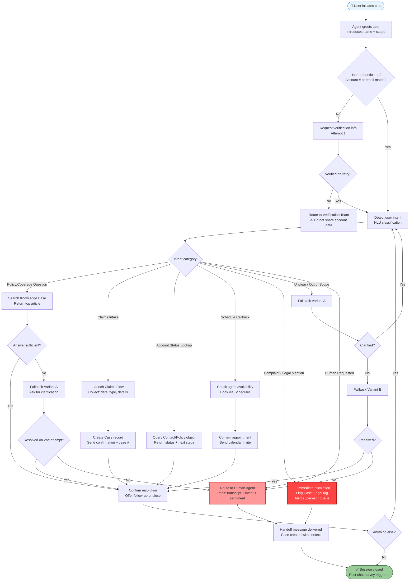

# ConversationFirst — Agentforce UX Design Framework
*Version 1.0 | Opticfy by JT Somwaru*

---

> **How to use this document:** This framework is applied at the start of every Agentforce deployment. Complete Part 1 before any agent is configured. Reference Parts 2–3 during build. Share Part 4 with prospects and clients to explain the methodology.

---

## Part 1: Agent Persona Template

*Complete one of these for every Agentforce agent before configuration begins. This document becomes the single source of truth for the agent's behavior, scope, and conversation design decisions.*

---

### AGENT PERSONA CARD

**Project:** `[Client Name — Project Name]`
**Date:** `[YYYY-MM-DD]`
**Version:** `[1.0]`
**Prepared by:** JT Somwaru, Opticfy

---

#### 1. Agent Identity

| Field | Value |
|---|---|
| **Agent Name** | `[e.g., "Aria" / "Max" / "PolicyBot" — avoid "Bot", avoid company name alone]` |
| **Agent Role Title** | `[e.g., Customer Support Specialist / Lead Intake Coordinator / HR Guide]` |
| **Deployment Channel(s)** | `[ ] Web Chat  [ ] Salesforce Experience Cloud  [ ] SMS  [ ] Email  [ ] Slack` |
| **Primary Language** | `[English / Spanish / Other]` |
| **Persona Archetype** | `[ ] Professional & Neutral  [ ] Warm & Approachable  [ ] Expert & Direct  [ ] Concise & Efficient` |

---

#### 2. Tone & Voice

**Core Voice Attributes** *(select 3–4)*:
- `[ ]` Confident but not arrogant
- `[ ]` Warm but not overly casual
- `[ ]` Clear and jargon-free
- `[ ]` Patient with repeated questions
- `[ ]` Proactive — offers next steps without being asked
- `[ ]` Empathetic — acknowledges frustration before solving
- `[ ]` Efficient — respects the user's time
- `[ ]` Other: `[describe]`

**Voice DON'Ts** *(mark all that apply)*:
- `[ ]` Never use filler phrases ("Great question!", "Absolutely!")
- `[ ]` Never refer to itself as a bot or AI unprompted
- `[ ]` Never use technical Salesforce terminology in user-facing responses
- `[ ]` Never use all-caps for emphasis
- `[ ]` Other: `[describe]`

**Sample Opening Message:**
> `[Write the exact first message this agent sends. E.g., "Hi, I'm Aria — I handle policy questions and claims support for [Company]. What can I help you with today?"]`

**Sample Tone-Setting Response** *(for a frustrated user)*:
> `[Write how the agent responds to: "This is ridiculous, I've been waiting 3 days." E.g., "I hear you — 3 days is too long, and I want to fix this now. Can you share your claim number so I can pull it up immediately?"]`

---

#### 3. Business Scope

**This agent serves:** `[e.g., Existing policyholders with active accounts / Inbound website leads / Current employees only]`

**Department owner:** `[e.g., Customer Service / Sales / HR]`

**Business context** *(2–3 sentences describing what this business does and why this agent exists)*:
> `[e.g., "Tri-State Insurance Group serves small business owners across the tri-state area. This agent handles first-contact support for existing policyholders — answering coverage questions, guiding claims intake, and routing complex issues to licensed agents."]`

**Volume expectation:** `[e.g., ~200 conversations/week during launch / Peak: Mondays 9–11AM]`

---

#### 4. What It Can Do

*List all in-scope capabilities. Be specific — vague scope leads to misconfigured agents.*

| # | Capability | Salesforce Action / Flow |
|---|---|---|
| 1 | `[e.g., Answer FAQs about coverage types]` | `[Knowledge Article lookup]` |
| 2 | `[e.g., Look up policy status by account number]` | `[Query Contact/Policy object]` |
| 3 | `[e.g., Initiate a claims intake form]` | `[Launch Flow: Claims_Intake_v2]` |
| 4 | `[e.g., Schedule a callback with a licensed agent]` | `[Create Task / Book via Scheduler]` |
| 5 | `[e.g., Confirm receipt of submitted documents]` | `[Query Case object]` |
| 6 | `[Add rows as needed]` | |

---

#### 5. What It Won't Do (Hard Limits)

*These are non-negotiable. The agent must refuse these clearly and route appropriately.*

| # | Out-of-Scope Action | Why | Redirect To |
|---|---|---|---|
| 1 | `[e.g., Quote new policies or coverage]` | `[Requires licensed agent]` | `[Route to Sales queue]` |
| 2 | `[e.g., Process payments or refunds]` | `[Financial transaction — liability]` | `[Route to Billing team]` |
| 3 | `[e.g., Provide legal or medical advice]` | `[Regulatory risk]` | `[Escalate to human + disclaimer]` |
| 4 | `[e.g., Access another customer's account data]` | `[Data privacy — GDPR/CCPA]` | `[Refuse + log attempt]` |
| 5 | `[e.g., Modify policy terms]` | `[Requires licensed underwriter]` | `[Route to Policy Services]` |
| 6 | `[Add rows as needed]` | | |

**Hard limit refusal language template:**
> *"That's something I'm not able to handle directly, but I want to make sure you get the right help. I'm going to connect you with [Team Name] — [they can usually resolve this in X minutes / I'll have them reach out within one business day]."*

---

#### 6. Escalation Thresholds

*Define exactly when and how the agent hands off to a human. Ambiguity here causes the most user frustration in production.*

| Trigger | Condition | Escalation Path | Priority |
|---|---|---|---|
| **Sentiment trigger** | User expresses anger, frustration, or distress (2nd mention) | Route to available human agent via omni-channel | High |
| **Complexity trigger** | User's question doesn't match any KB article after 2 attempts | Route to subject matter expert queue | Medium |
| **Legal/compliance trigger** | User mentions lawsuit, attorney, regulatory complaint | Escalate immediately; flag Case with "Legal" tag | High |
| **Loop trigger** | Agent has asked for clarification 3 times without resolution | Break loop, offer callback | Medium |
| **Explicit request** | User says "agent," "human," "representative," or "talk to someone" | Transfer immediately, no argument | High |
| **Silence trigger** | No user response for `[X]` minutes | Send timeout message; close or queue for follow-up | Low |
| **Data mismatch** | User's identity can't be verified after 2 attempts | Do not share account data; route to verification team | High |

**Escalation handoff message template:**
> *"I'm going to connect you with a member of our [team name] team now. I'll pass along what we've discussed so you won't need to repeat yourself. One moment."*

**Post-escalation context package** *(what gets passed to the human agent)*:
- `[ ]` Conversation transcript
- `[ ]` User-provided account/policy number
- `[ ]` Detected intent / topic category
- `[ ]` Sentiment score (if available)
- `[ ]` Number of loop/fallback triggers hit
- `[ ]` Escalation reason tag

---

#### 7. Fallback Language

*What the agent says when it's confused, can't find an answer, or something breaks. Every deployment needs at least 3 fallback variants to avoid repetitive responses.*

**Fallback Variant A** *(first-time confusion)*:
> `"I want to make sure I get this right for you. Could you tell me a little more about what you're looking for? For example, [give a relevant example prompt]?"`

**Fallback Variant B** *(second confusion in same session)*:
> `"I'm having a hard time finding exactly what you need, and I don't want to waste your time. Let me get someone who can help — or if you prefer, I can send you a link to [resource]."`

**Fallback Variant C** *(total failure / system error)*:
> `"Something unexpected happened on my end — I'm sorry about that. Your issue hasn't been lost. [Provide case number if available.] A member of our team will follow up within [timeframe]. Is there anything else I can try to help with in the meantime?"`

**Topic mismatch fallback** *(user asks something clearly out of scope)*:
> `"That's a bit outside what I'm set up to help with here — I handle [scope]. For [user's topic], [Name] team is the right contact: [contact method]. Want me to help with anything else today?"`

---

#### 8. Success Metrics

*Defined before launch. Reviewed at 30/60/90-day checkpoints.*

| Metric | Target | Measurement Method |
|---|---|---|
| **Containment Rate** | `[e.g., ≥65% — conversations resolved without human]` | Salesforce Einstein Analytics / Dashboard |
| **CSAT Score** | `[e.g., ≥4.2/5.0 on post-chat survey]` | Post-chat survey (Embedded Feedback) |
| **Avg. Handle Time (agent-assisted)** | `[e.g., <4 min for escalated chats]` | Omni-Channel report |
| **Escalation Rate** | `[e.g., ≤35% of conversations]` | Case creation rate vs. conversation count |
| **Fallback Trigger Rate** | `[e.g., <15% — indicates knowledge gap]` | Custom Flow logging |
| **First-Contact Resolution** | `[e.g., ≥55% — resolved in one session]` | Case reopened rate |
| **Loop/Abandonment Rate** | `[e.g., <8%]` | Conversation exit analysis |

**30-Day Review Triggers** *(if any of these hit, revisit persona + flows)*:
- Containment drops below target for 3 consecutive days
- Fallback trigger rate exceeds 20%
- Any single escalation category spikes >50% week-over-week
- CSAT drops below 3.8

---

*Persona Card sign-off:*

| Role | Name | Date |
|---|---|---|
| Conversation Designer | JT Somwaru, Opticfy | |
| Client Stakeholder | | |
| Technical Owner | | |

---

## Part 2: Conversation Flow Diagrams

*These Mermaid diagrams represent the primary conversation paths for three common Agentforce deployments. Customize node labels and routing logic per client. Each diagram covers: happy path, fallback handling, and human escalation.*

---

### Use Case 1: Customer Service Agent
*(Handles inquiries, routes escalations — e.g., insurance, services, general B2B support)*



---

### Use Case 2: Lead Routing Agent
*(Qualifies and assigns inbound leads — e.g., construction, wholesale, professional services)*

```mermaid
flowchart TD
    A([👤 Inbound lead — web form / chat / SMS]) --> B[Agent greets lead\n'Hi, I'm [Name] — I'll get you to the right person.\nJust a few quick questions.']
    B --> C[Collect: First name, company, role]

    C --> D{Company size?}
    D -- 1–10 employees --> D1[Tag: SMB]
    D -- 11–100 employees --> D2[Tag: Mid-Market]
    D -- 100+ employees --> D3[Tag: Enterprise]

    D1 & D2 & D3 --> E[What brings you in today?\nOpen-text intent capture]

    E --> F{Intent classification}

    F -- Pricing inquiry --> G[Provide tiered overview\nNo hard quotes — 'Our team will confirm exact pricing']
    F -- Product demo request --> H[Book demo via Scheduler\nAssign to AE pool]
    F -- Partnership / Vendor --> I[Route to Partnerships inbox\nNot Sales queue]
    F -- Existing customer --> J[Route to Customer Success\nNot Sales — log mismatch]
    F -- Unclear --> K[Clarifying question\n'Are you looking to [option A] or [option B]?']
    K --> K1{Clarified?}
    K1 -- Yes --> F
    K1 -- No --> K2[Route to general Sales queue\nTag: 'Needs qualification']

    G & H --> L{Timeline to decide?}
    L -- Immediately / This month --> L1[Tag: Hot 🔥\nPriority: High\nNotify AE within 15 min]
    L -- 1–3 months --> L2[Tag: Warm 🌡️\nPriority: Medium\nEnroll in nurture sequence]
    L -- 3+ months / Exploring --> L3[Tag: Cold ❄️\nPriority: Low\nAdd to newsletter + quarterly touchpoint]

    L1 & L2 & L3 --> M[Geographic assignment]
    M --> M1{Territory?}
    M1 -- NYC Metro --> AE1[Assign: NYC AE Team]
    M1 -- Northeast --> AE2[Assign: Northeast AE]
    M1 -- National / Other --> AE3[Assign: Inside Sales]

    AE1 & AE2 & AE3 --> N[Create Lead record in Salesforce\nLog: source, intent, size, timeline, territory]
    N --> O[Send lead confirmation message\n'You're all set — [AE Name] will reach out within [SLA].']
    O --> P[Internal AE notification\nPush: Slack / email / Salesforce task]

    I --> Q[Create Lead — type: Partner\nRoute to Partnerships]
    J --> R[Create Case — type: Existing Customer Mismatch\nRoute to CS team]

    K2 --> N

    O --> CLOSE([✅ Session complete\nLead created + assigned + AE notified])
    Q --> CLOSE
    R --> CLOSE

    style L1 fill:#ff9966,stroke:#cc5500
    style L2 fill:#ffdd66,stroke:#cc9900
    style L3 fill:#aaddff,stroke:#3399cc
    style CLOSE fill:#99cc99,stroke:#336633
    style A fill:#e8f4fd,stroke:#4a90d9
```

---

### Use Case 3: HR Assist Agent
*(Answers employee policy questions, routes to HR — e.g., internal deployment for 50–500 person orgs)*

```mermaid
flowchart TD
    A([👤 Employee opens HR chat]) --> B[Agent greets\n'Hi [Name], I'm your HR Guide.\nI can answer policy questions and connect you with HR when needed.\nWhat can I help you with?']

    B --> C{Employee identity confirmed?\nSSO / Employee ID}
    C -- No --> C1[Request Employee ID]
    C1 --> C2{Verified?}
    C2 -- No --> C3[Cannot proceed\n'Please contact HR directly: hr@company.com']
    C2 -- Yes --> D

    C -- Yes --> D[Classify question topic]

    D --> E{Topic}

    E -- Time off / PTO --> F[Pull PTO policy from Knowledge Base\nConfirm: accrual rate, carry-over, request process]
    F --> F1[Link to PTO request form / Flow]
    F1 --> CONFIRM

    E -- Benefits / Health Insurance --> G[Return benefits summary\nLink to enrollment portal]
    G --> G1{Open enrollment active?}
    G1 -- Yes --> G2[Highlight deadline + CTA\n'Enrollment closes [date] — link below']
    G1 -- No --> G3[Log inquiry for Benefits team\nSend next enrollment window date]
    G2 & G3 --> CONFIRM

    E -- Payroll / Pay discrepancy --> H{Nature of issue}
    H -- General payroll question --> H1[Return payroll schedule + FAQ]
    H1 --> CONFIRM
    H -- Discrepancy / Error --> H2[🚨 Route to Payroll HR\nCreate Case: type Payroll Issue\nSLA: 1 business day response]
    H2 --> CONFIRM

    E -- Leave of absence / FMLA --> I[Provide high-level overview\n'FMLA covers up to 12 weeks — here's how to start the process']
    I --> I1[Route to HR Business Partner\nThis requires a direct conversation]
    I1 --> CONFIRM

    E -- Workplace concern / Complaint --> J[🚨 Sensitive topic protocol\nAcknowledge + immediate warm handoff]
    J --> J1[Route to HR Director / Employee Relations\nDo not attempt to resolve — escalate only]
    J1 --> CONFIRM

    E -- IT / System access --> K[This is outside HR scope\nRoute to IT Help Desk\nLink / ticket creation if available]
    K --> CONFIRM

    E -- Manager conflict / Performance --> L[Acknowledge — do not log details\n'This is best handled directly with HR.\nWould you like me to schedule time with your HR Business Partner?']
    L --> L1{Schedule meeting?}
    L1 -- Yes --> L2[Book via Scheduler\nCreate: HR Meeting task]
    L1 -- No --> L3[Provide HRBP contact info]
    L2 & L3 --> CONFIRM

    E -- Unclear --> M[Fallback: 'Can you tell me a bit more?\nFor example, are you asking about [PTO / benefits / payroll / something else]?']
    M --> M1{Clarified?}
    M1 -- Yes --> D
    M1 -- No --> M2[Route to general HR inbox\nTag: Needs classification]
    M2 --> CONFIRM

    CONFIRM[Confirm response delivered\nOffer: 'Is there anything else I can help with?']
    CONFIRM --> Z{More questions?}
    Z -- Yes --> D
    Z -- No --> CLOSE([✅ Session closed\nLog: topic + resolution type])

    style J fill:#ff9999,stroke:#cc0000
    style H2 fill:#ffcc88,stroke:#cc6600
    style J1 fill:#ff9999,stroke:#cc0000
    style CLOSE fill:#99cc99,stroke:#336633
    style A fill:#e8f4fd,stroke:#4a90d9
    style C3 fill:#ffdddd,stroke:#cc4444
```

---

## Part 3: Pre-Deploy UX Checklist

*Complete this checklist before any Agentforce agent goes live. Every unchecked item is a potential support escalation or user abandonment. No partial launches.*

**Agent Name:** `__________________________`
**Client:** `__________________________`
**Reviewer:** JT Somwaru, Opticfy
**Review Date:** `__________________________`
**Target Go-Live:** `__________________________`

---

### Section A: Persona & Tone

- [ ] **1. Opening message reviewed** — First message is warm, states agent name, and sets scope clearly. No generic "How can I help you?" without context.
- [ ] **2. Tone is consistent** — Spot-checked at least 10 conversation paths. Voice stays consistent across happy path, fallback, and escalation messages.
- [ ] **3. No filler language** — Removed "Great question!", "Absolutely!", "Certainly!" from all agent responses.
- [ ] **4. Agent does not claim to be human** — If asked "Are you a bot/AI?" the agent answers honestly without being evasive.
- [ ] **5. Name/identity is consistent** — Agent uses the same name throughout. No identity drift across long sessions.

---

### Section B: Scope & Boundaries

- [ ] **6. In-scope capabilities confirmed live** — Every capability listed in the Persona Card (Part 1, Section 4) has been tested end-to-end in a sandbox environment.
- [ ] **7. Hard limits enforced** — Every out-of-scope action (Part 1, Section 5) triggers an appropriate refusal and redirect. None silently fail or return blank responses.
- [ ] **8. Out-of-scope refusal language is helpful** — Hard limit responses tell the user *what to do next*, not just what the agent can't do.
- [ ] **9. Authentication gates are functional** — If the agent requires identity verification, the verification flow has been tested for: success, failure, retry, and timeout.

---

### Section C: Escalation Paths

- [ ] **10. All escalation triggers tested** — Every trigger defined in the Persona Card (Part 1, Section 6) has been validated: sentiment, complexity, legal/compliance, loop, explicit request, silence.
- [ ] **11. "Talk to a human" request routes immediately** — Tested with exact phrases: "agent," "human," "real person," "representative," "talk to someone." Agent does not deflect or argue.
- [ ] **12. Handoff message is in place** — User receives a clear message before transfer. They know where they're going, approximate wait, and that their context is being passed.
- [ ] **13. Context package is populated** — Escalating human agent receives: transcript, intent tag, sentiment, account data (if applicable), escalation reason. No blank handoffs.
- [ ] **14. Queue routing confirmed** — Tested that escalations land in the correct Omni-Channel queue (or email/Slack channel, per client setup). Verified with internal team.
- [ ] **15. After-hours escalation path defined** — If escalation is triggered outside business hours, a clear fallback exists (async case creation, auto-response with SLA, callback booking).

---

### Section D: Fallback & Error Handling

- [ ] **16. All three fallback variants are active** — Agent uses Variant A on first confusion, Variant B on second, Variant C on system error. No single fallback repeated more than twice consecutively.
- [ ] **17. Loop prevention is configured** — After 3 failed clarification attempts, agent breaks the loop and either escalates or offers alternative (link, callback, email).
- [ ] **18. Timeout handling is defined** — Tested what happens when a user goes silent. Agent sends a timeout message at `[X]` minutes, and session closes or queues gracefully at `[Y]` minutes.
- [ ] **19. System error fallback tested** — Simulated a downstream failure (Knowledge Base unavailable, Flow error). Agent surfaces Variant C and does not expose technical error details to the user.
- [ ] **20. Empty state handling** — Tested queries that return zero Knowledge Base results. Agent does not return a blank message or raw "No results found" string.

---

### Section E: Conversation Quality

- [ ] **21. Confirmation patterns are in place** — For any action with a real-world effect (case creation, appointment booking, form submission), the agent confirms the action and provides a reference ID or next step.
- [ ] **22. Multi-turn context is maintained** — Tested a 5+ turn conversation. Agent retains context from earlier in the session (e.g., doesn't ask for account number twice).
- [ ] **23. Edge cases tested** — Minimum 5 edge-case inputs tested per major intent category: misspellings, partial inputs, mid-sentence topic changes, all-caps messages, emoji-only inputs.
- [ ] **24. Mobile rendering verified** — If deployed on web/Experience Cloud, conversation UI tested on mobile viewport. Messages are readable; no truncation or layout breaks.
- [ ] **25. Post-chat survey is live** — If CSAT measurement is in scope, survey trigger is confirmed and tested. Survey fires on both self-served and escalated conversations.

---

**Final sign-off:**

| Checkpoint | Status | Notes |
|---|---|---|
| All 25 items checked | `[ ] Yes  [ ] No — [items outstanding]` | |
| Client stakeholder reviewed | `[ ] Yes  [ ] Pending` | |
| Approved for production | `[ ] Yes  [ ] Hold — [reason]` | |

*No agent goes live with fewer than 23/25 items checked. Items 10, 11, 13, and 16 are non-negotiable.*

---

## Part 4: ConversationFirst Methodology (Shareable 1-Pager)

---

# ConversationFirst™
### A Methodology for Agentforce Agents That Are Actually Usable

*By JT Somwaru | Opticfy AI Consulting*

---

#### The Problem With Most AI Agent Deployments

When organizations deploy Agentforce, they focus on what the agent *can do* — integrations, data access, automation triggers. That's the right instinct, but it misses half the equation.

An agent that's technically capable but conversationally broken will fail in production. Users will abandon it. Support tickets won't decrease. The ROI won't materialize. And the organization will conclude that "AI agents don't work" — when the real issue was that no one designed the conversation.

Most Agentforce deployments skip conversation design entirely. There's no defined persona. No fallback strategy. No escalation protocol that a human agent actually trusts. The result is an agent that handles the demo perfectly and confuses real users on day one.

**ConversationFirst fixes that.**

---

#### What ConversationFirst Is

ConversationFirst is a pre-configuration design methodology applied before any Agentforce agent is built. It treats conversation design as a first-class deliverable — not an afterthought.

The methodology is built on a simple premise: **every agent interaction is a user experience.** The quality of that experience determines whether your agent succeeds or fails — not the sophistication of the underlying automation.

---

#### The Four-Step Approach

**Step 1 — Define the Persona**
Before any configuration begins, we document the agent's identity, tone, scope, hard limits, and escalation rules in a standardized Agent Persona Card. This document becomes the single source of truth for every decision made during build. It eliminates scope creep, alignment gaps between business and technical stakeholders, and post-launch surprises.

**Step 2 — Map the Conversations**
We diagram every major conversation path the agent will handle — including edge cases, fallbacks, and human handoffs — using structured flow diagrams. These diagrams expose gaps before they reach production. They also serve as the technical specification for Flow builders and the communication tool for non-technical stakeholders who need to sign off.

**Step 3 — Design for Failure**
We define exactly what the agent does when it doesn't know something, when a user is frustrated, when a system is unavailable, and when the conversation should be handed to a human. Most deployments treat failure as an afterthought. In ConversationFirst, failure paths are designed with the same rigor as success paths — because they're what users remember.

**Step 4 — Validate Before Launch**
Every agent passes a 25-point Pre-Deploy UX Checklist before going live. We test edge cases, confirm escalation routing, verify fallback language, validate multi-turn context retention, and confirm that every action the agent takes is confirmed to the user. Agents that haven't passed the checklist don't launch.

---

#### What Clients Receive

Every ConversationFirst engagement delivers four tangible artifacts:

1. **Agent Persona Card** — a completed design document that defines the agent's identity, capabilities, limits, and escalation logic. Owned by the client. Referenced for any future updates.

2. **Conversation Flow Diagrams** — visual maps of every major conversation path, in Mermaid/diagram format. Used during build, during stakeholder review, and as living documentation post-launch.

3. **Pre-Deploy UX Checklist** — a completed, signed-off quality gate confirming the agent is ready for production. Serves as the record of what was tested and approved before go-live.

4. **30/60/90-Day Review Framework** — defined success metrics and review triggers so clients know exactly how to measure whether the agent is working — and when to revisit the design.

---

#### Who This Is For

ConversationFirst is designed for mid-market organizations deploying Agentforce for the first time, or organizations that have deployed an agent and seen underwhelming results. It's particularly effective for:

- **Customer-facing agents** where a poor conversation experience directly impacts brand perception and retention
- **Internal agents** (HR, IT, operations) where low adoption undermines the ROI case for AI investment
- **Sales-adjacent agents** (lead routing, qualification) where a misconfigured handoff means lost revenue

---

#### The Bottom Line

Agentforce is a powerful platform. The gap between a functional agent and an effective one isn't technical — it's conversational. ConversationFirst is how Opticfy closes that gap.

---

*To apply ConversationFirst to your next Agentforce deployment, contact:*
**JT Somwaru | Opticfy AI Consulting**
*jt@opticfy.co | linkedin.com/in/jon-trevor-somwaru*

---

*ConversationFirst — Agentforce UX Design Framework | Version 1.0*
*© 2026 Opticfy by JT Somwaru. For client and portfolio use.*
