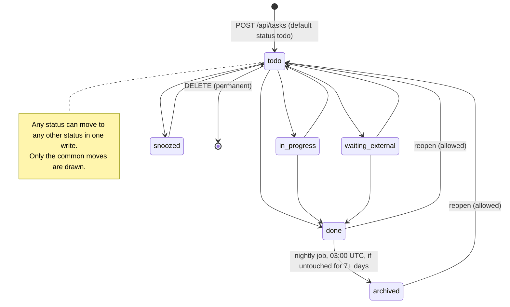
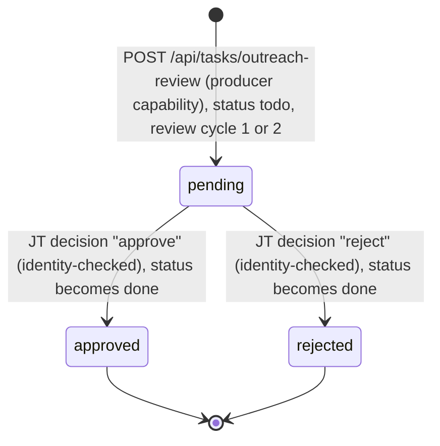
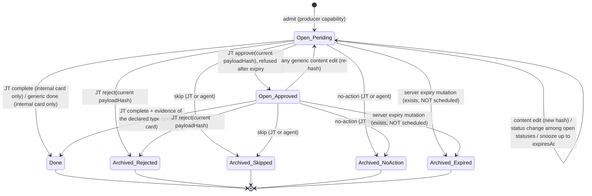
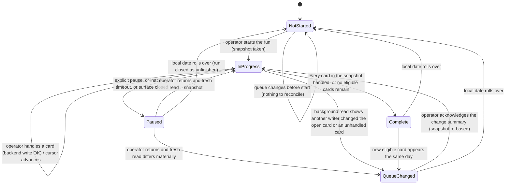

# Mission Control — State Map

Two kinds of content, each clearly labeled:

- **BACKEND TRUTH:** behavior the server or logic layer enforces today, with the file that enforces it. Paths are relative to the Mission Control app root.
- **PROPOSAL:** a daily-run state machine that does not exist anywhere in the code. It is offered for the redesign to adopt, change, or reject.

Field and endpoint details are in `01-data-contract.md`.

---

## Part A — BACKEND TRUTH: per-card lifecycles

There are three card families with different rules. One card belongs to exactly one family:
- **Lane packet:** `packetSchema: "lane-packet-v1"`.
- **Outreach review card:** has `outreachReview`.
- **Generic task:** everything else, including the 31 Growth OS decision cards, legacy pipeline cards, and agent-owned cards.

### A1. Generic task

| From | To | Trigger | Who | Source |
|---|---|---|---|---|
| (none) | todo or any given status | `POST /api/tasks` (default `todo`; with dedupeKey it **upserts** over an existing card) | any caller | `app/api/tasks/route.ts:49-86` |
| any | any | `PATCH /api/tasks {id, status}` | any caller, no identity check | `convex/tasks.ts:871-910` |
| done | archived | Scheduled job, daily 03:00 UTC, when `updatedAt` is more than 7 days old | server | `convex/crons.ts:6-11`, `convex/tasks.ts:1028-1046` |
| any | deleted | `DELETE /api/tasks?id=` | any caller | `convex/tasks.ts:928-940` |

These overlays sit on top of status. They are not statuses:
- `waitingOn` parks the card until a nudge is due.
- `snoozedUntil` hides the card from Today until that time.
- `priority`, `sortOrder` and every other field can be edited freely.

Completing a card needs no proof, approval or identity, even when `proofRequired` is true.

Caveat for nightly-validation cards (none live): every generic edit re-checks admission rules. Once `verifiedAt` is more than 24 hours old, any `PATCH /api/tasks` edit, including a status change, is refused (`convex/tasks.ts:904`).

### A2. Outreach review card (immutable snapshot)

| Rule | Source |
|---|---|
| A decision is accepted only while status is `todo`. It is recorded once with `decidedBy: "jt"` and server time | `lib/mission-control/outreach-decision.ts:66-99` |
| The same decision again is a no-op. A different decision or a changed snapshot is refused (409); a new versioned card is required | same, lines 74-84 |
| Every generic edit, status change, pipeline-stage change, upsert and delete throws. Auto-archive skips these cards | `outreach-decision.ts:101-105`; `convex/tasks.ts:1038` |
| At most 2 review cycles per candidate + cohort. A third distinct snapshot → 409 | `docs/mission-control-outreach-review-contract.md` |
| A feedback append is still allowed and does not touch the snapshot | `convex/tasks.ts:912-926` |

Live: 6 cards. 4 are decided (all reject, status done) and 2 are pending (todo).

### A3. Lane packet (Growth OS card envelope v1)

Two dimensions: **status** (open or terminal) × **approvalState** (pending, approved, rejected).

"Open" means status todo, in-progress, waiting-external or snoozed. "Internal" means `doneEvidenceType: "none"`; "external" means any other evidence type.

| From | To | Trigger | Actor | Guard | Source (`lib/mission-control/`) |
|---|---|---|---|---|---|
| — | Open + pending | `POST /api/tasks/lane-packet` | producer | strict allowlist; expiresAt within 90 days; estMinutes 1–480; dedupe on key + payload hash | `lane-packet.ts:286-393, 456-503` |
| Open | Open + approved | `approve` | JT only | hash equals current `payloadHash`; not expired | `lane-packet-transitions.ts:135-143` |
| Open + approved | Open + pending | Generic edit to title, description, firstAction, whyItMatters, exactSteps, pasteReadyPrompt, pasteDestination or doneState | anyone | content hash changed | `lane-packet-transitions.ts:219-223` |
| Open | Archived (rejected) | `reject` | JT only | hash equals current; expiry does not block | lines 144-150 |
| Open | Done | `complete` | JT only | external card: approved current hash plus evidence of the declared type (https for post-url). Internal card: no evidence allowed or needed. Expiry does not block | lines 151-179 |
| Open (internal) | Done | Generic status done | anyone | only when `doneEvidenceType: "none"` | line 211 |
| Open | Archived (skipped / no-action) | `skip` / `no-action` | JT or agent | none | lines 180-184; agent limit `lane-packet-route.ts:42, 161-163` |
| Open | (hidden from Today) | Clock passes `expiresAt` | read time | none | `lane-capacity.ts:16-18`, `score.ts:215-218` |
| Open | Archived (expired) | `tasks.expireDueLanePackets` | server | **not scheduled** | `convex/tasks.ts:557-571`, `lane-packet-transitions.ts:189-192` |
| Terminal | anything | any write except a feedback append | — | refused: "closed" | lines 131, 209; delete refused line 226 |

Live: 1 packet (jobs lane): open, pending, edited since admission, expires in 2 days.

### A4. Today eligibility (derived on every read; not stored)

The data hook refetches every 60 seconds (`lib/mission-control/hooks.ts`, `POLL_MS = 60_000`). Each read recomputes, for every card, one of these outcomes (`lib/mission-control/score.ts:207-248`):

| Outcome | Condition (checked in this order) |
|---|---|
| Not a decision | entry is an agent definition or proof record |
| Hidden: closed | status done, archived or snoozed |
| Hidden: expired | lane packet at or past `expiresAt` (counted, not listed) |
| Hidden: snoozed | `snoozedUntil` is in the future |
| Hidden: agent's work | owner `eve` and not failed |
| Parked | `waitingOn.who` set and the nudge is not yet due |
| **Nudge due** | `waitingOn` nudge is overdue. Shown as `Nudge <who>: <what>` |
| Ranked | everything else, scored 0–100 |
| Over lane budget | lane packet that doesn't fit the week's per-lane minutes (counted, not listed) |
| In queue | ranks 1–7 after the budget filter |
| Below the cut | rank 8 or lower |

A card's outcome changes without any write when a timer passes (snooze end, nudge due, expiry), when another writer edits it, or when the week's focus row changes.

---

## Part B — PROPOSAL: daily-run state machine

> Nothing in Part B exists in the backend. There is no run record, no per-day progress, and no "handled in this run" marker anywhere in the schema (`convex/schema.ts`). Supporting it needs either client-only state (one device; lost if cleared) or a new backend table (a schema change, separately gated). The triggers below use only signals the backend already exposes.

**Definitions (proposal)**
- **Run:** one operator pass through the day's decision queue on one local date.
- **Snapshot:** taken when a run starts. It is the ordered list of `{_id, status, updatedAt, payloadHash?, approvalState?, expiresAt?}` for every card in the run's scope. The scope is the redesign's choice: the Today queue, the decision-card set, or both.
- **Handled:** the operator acted on a card in this run. Each action maps to a real backend write:
  - Approve, reject or complete → lane-packet or outreach transition.
  - Done → status write.
  - Defer → `{priority: "low", status: "todo"}`, or `snoozedUntil`.
  - Answer → feedback append. This is the only append-only channel today, because no answer field exists.
  - Skip-for-today → stored in run state only; no backend write.
- **Material change:** a fresh read differs from the snapshot in any of these ways:
  - a card entered or left scope;
  - a card's `updatedAt` or `payloadHash` changed (approval may have reset to pending);
  - a card's status or approval changed;
  - a card passed `expiresAt`;
  - the rank order of unhandled cards changed.

| # | From | To | Trigger | Backend signal used | Notes |
|---|---|---|---|---|---|
| 1 | Not started | In progress | Operator starts the run | `GET /api/tasks` + focus row → ranked queue | The snapshot is taken here |
| 2 | In progress | In progress | Operator handles the current card | Write returns success | Cursor moves to the next unhandled card. A failed write (409 conflict/closed/expired) does not advance; it goes to transition 6 |
| 3 | In progress | Paused | Explicit pause, inactivity timeout (length to decide), or surface closed or hidden | none (client event) | |
| 4 | Paused | In progress | Operator returns; fresh read matches the snapshot | Fresh `GET /api/tasks`, compared field by field | |
| 5 | Paused | Queue changed while away | Operator returns; fresh read differs materially | Same comparison | Show what was added, removed and changed, and any approval reset to pending |
| 6 | In progress | Queue changed while away | A 60-second background read, or a refused write, shows another writer changed the open card or an unhandled card | 60 s poll; 409 responses | Prevents acting on stale content: approval is bound to the payload hash |
| 7 | Queue changed while away | In progress | Operator acknowledges the change summary | none | Snapshot re-based; handled cards stay handled |
| 8 | In progress | Complete | Every snapshot card handled, or no eligible card remains | Ranked queue is empty of unhandled cards | |
| 9 | Complete | Queue changed while away | A new eligible card appears the same local date | 60 s poll | Re-opens the run instead of starting a second one |
| 10 | Paused / Complete / Queue changed | Not started | Local date rolls over | Clock (local time, matching how the focus row's week is computed) | The prior run is summarized and closed |
| 11 | Not started | Not started | Queue changes before the run starts | 60 s poll | Nothing to reconcile |

**Open questions the proposal leaves to the redesign**
1. Scope of a run: the Today queue (7 slots; none of the 31 decision cards reaches it under current scoring), the 31 decision cards, or a dedicated decision lane.
2. Run order: the intended Q1 → AP9 order exists only as `sortOrder` and title codes. Today and the Work list both rank it in reverse (see `01-data-contract.md` §7.3).
3. Where an answer is recorded for the 19 cards with an empty `Answer:` slot: a feedback append (append-only, author unverified) or a future typed field.
4. Where run state lives: client-only, or a new backend table.
